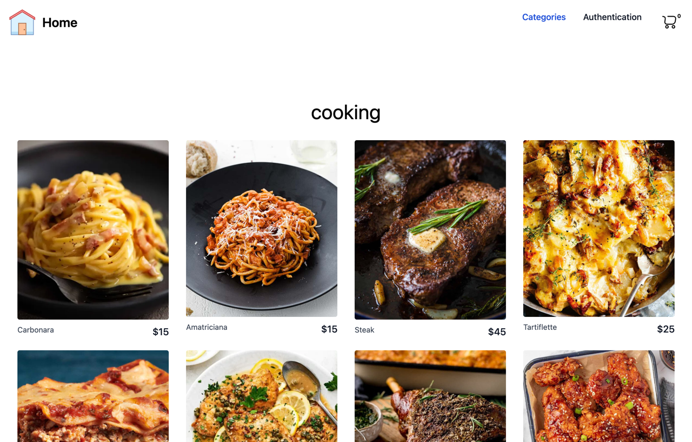
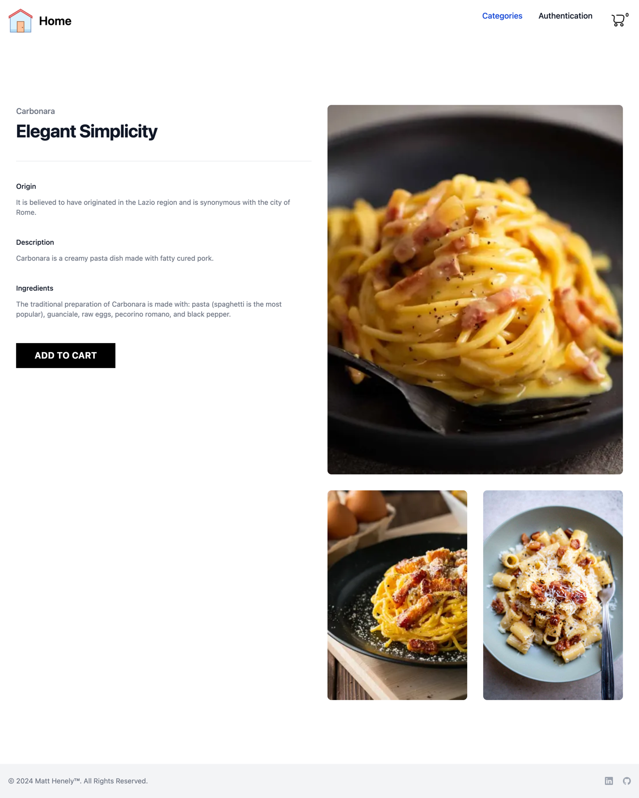
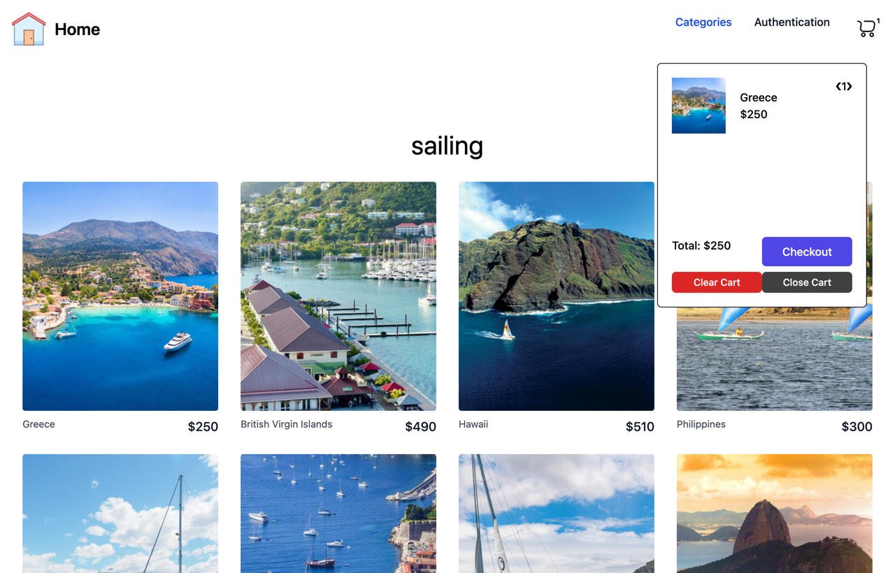

# shopALot 🛒

[](https://github.com/mhenely/shopALot/actions/workflows/ci.yml)

A full-stack **MERN** e-commerce application — browse a catalog by category, manage a
shopping cart that survives login and page reloads, and check out. Built to practice
production-shaped patterns end to end: a REST API, JWT authentication, server-synced
state, automated tests, and continuous deployment.

### 🔗 Live demo: **[mhenely.netlify.app](https://mhenely.netlify.app)**

> Frontend on Netlify · API on Railway · MongoDB Atlas. Sign up with any username
> (4+ chars) and password (5+ chars) — no email required.


---

## Features

- **Product catalog** — categories and products served from MongoDB and rendered with
  loading / error / not-found states.
- **JWT authentication** — register and log in; passwords hashed with bcrypt, tokens
  signed server-side and attached to API requests via an axios interceptor.
- **Smart shopping cart** — persists in the backend for logged-in users and in
  `localStorage` for guests, and **merges the guest cart into the account on login**.
- **Checkout** — place an order, which clears the cart and shows a confirmation.
- **Responsive UI** — built entirely with Tailwind CSS; keyboard-accessible navigation.
- **Tested** — backend integration tests and frontend component/unit tests (24 total).

## Tech stack

| Layer | Technologies |
| --- | --- |
| **Frontend** | React 18, Redux Toolkit (async thunks), React Router 6, Tailwind CSS, axios, Vite |
| **Backend** | Node.js, Express, Mongoose, JSON Web Tokens, bcrypt |
| **Database** | MongoDB (Atlas) |
| **Testing** | `node:test` + supertest (API), Vitest + React Testing Library (UI) |
| **Deployment** | Netlify (frontend) · Railway (backend) — auto-deploy on push to `main` |

## Screenshots

| Category page | Product detail | Cart |
| --- | --- | --- |
|  |  |  |

## Architecture

A monorepo with independently deployable halves:

```
shopALot/
├── backend/                 # Express REST API
│   ├── controllers/         # route handlers (login, users, category, shopItems, cart)
│   ├── models/              # Mongoose schemas (User, Category, ShopItem)
│   ├── utils/               # config, middleware (JWT extractor, error handler), seed data
│   ├── scripts/             # seed.js (populate DB), cart-smoke.js
│   ├── tests/               # supertest integration tests
│   ├── app.js               # Express app (no DB connection — importable for tests)
│   └── index.js             # connects to MongoDB and starts the server
└── frontend/                # React + Vite single-page app
    └── src/
        ├── api/             # axios client + endpoint modules
        ├── app/             # App shell + routed pages
        ├── components/      # UI components
        ├── features/        # Redux slices (shopData, auth, cart)
        └── stores/          # Redux store
```

**Cart sync strategy:** every cart mutation runs through a Redux async thunk that branches
on auth state — logged-in users hit the `/cart` API (server is the source of truth), while
guests update `localStorage`. On login, the guest cart is pushed to the server and merged.

## Getting started

### Prerequisites
- [Node.js](https://nodejs.org/) 18+
- A [MongoDB](https://www.mongodb.com/) connection string (a free Atlas cluster works)

### 1. Clone
```bash
git clone https://github.com/mhenely/shopALot.git
cd shopALot
```

### 2. Backend
```bash
cd backend
npm install
cp .env.example .env        # then fill in the values (see below)
npm run seed                # populate the DB with categories + products
npm run dev                 # API on http://localhost:3001
```

`backend/.env`:
```
MONGODB_URI=<your MongoDB connection string>
TEST_MONGODB_URI=<connection string for tests (the suite isolates a 'shopalot_test' db)>
PORT=3001
SECRET=<any long random string for signing JWTs>
```

### 3. Frontend
```bash
cd frontend
npm install
npm run dev                 # app on http://localhost:5173
```

The frontend talks to `http://localhost:3001` by default. To point it elsewhere, create
`frontend/.env` with `VITE_API_URL=<backend url>`.

## Testing

```bash
# Backend API integration tests (auth, catalog, cart lifecycle)
cd backend && npm test

# Frontend unit + component tests (cart logic, components)
cd frontend && npm test
```

## API overview

| Method | Endpoint | Auth | Description |
| --- | --- | --- | --- |
| `POST` | `/users` | — | Register a new user |
| `POST` | `/login` | — | Log in, returns a JWT |
| `GET` | `/category` | — | Categories with populated products |
| `GET` | `/shopItems` | — | All products |
| `GET` | `/cart` | ✅ | Current user's cart |
| `POST` | `/cart` | ✅ | Add an item (or increment) |
| `PATCH` | `/cart` | ✅ | Set an item's quantity (0 removes it) |
| `DELETE` | `/cart/:itemId` | ✅ | Remove one item |
| `DELETE` | `/cart` | ✅ | Clear the cart |

## Possible future enhancements

- A shipping/payment step and a persisted `Order` model (checkout currently confirms and
  clears the cart without storing the order).
- Protect the admin-style write endpoints (`POST /category`, `POST /shopItems`).
- GitHub Actions CI to run the test suites on every pull request.
- Image optimization and a product search/filter.

---

Built by [Matt Henely](https://github.com/mhenely).
